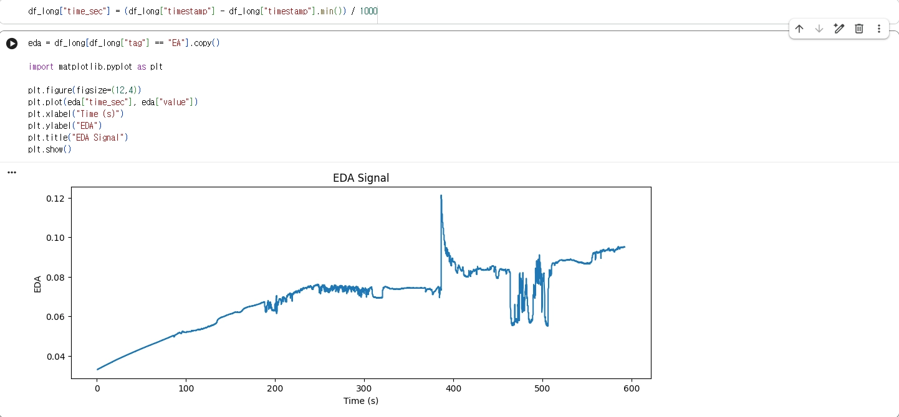
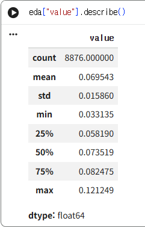
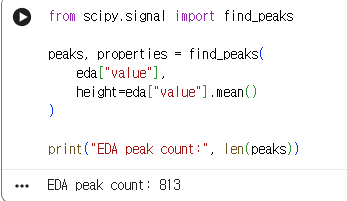
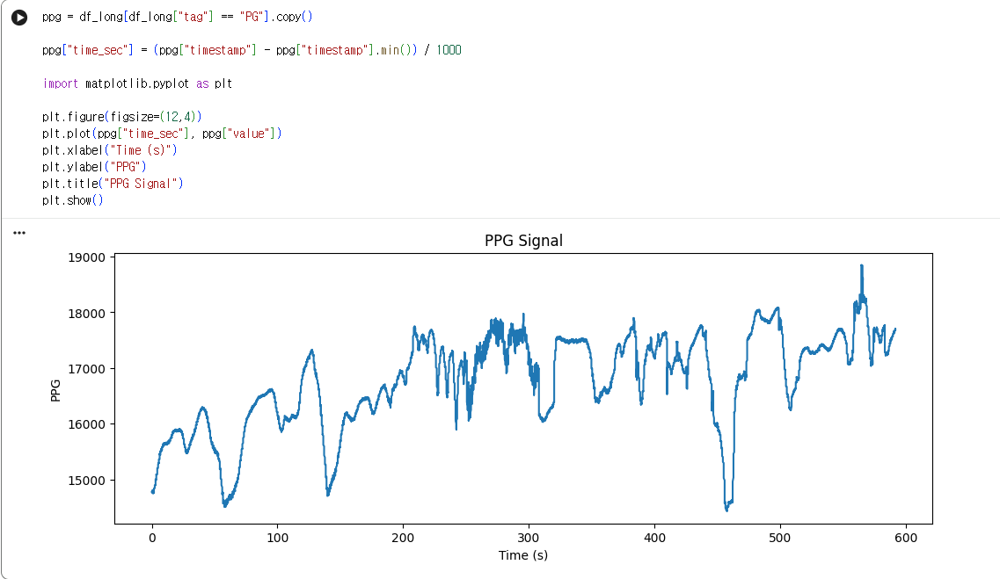
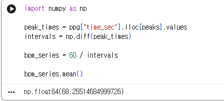
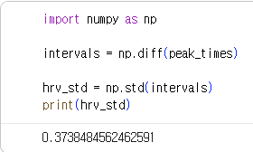
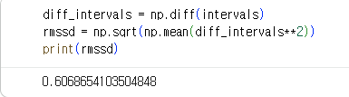
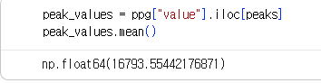
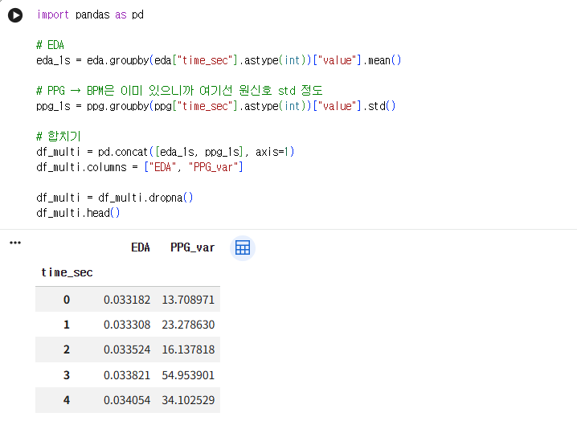
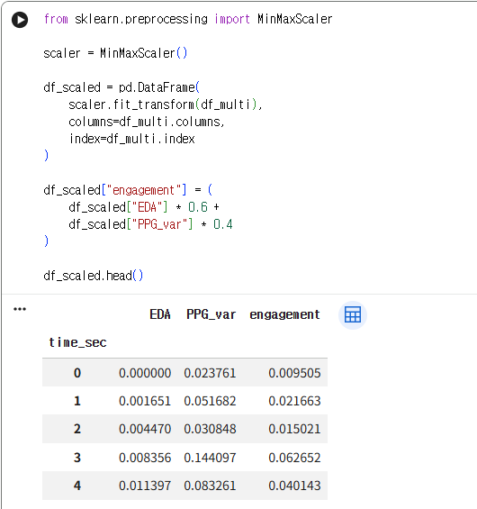

# EmotiBit LSL to ROS 2

EmotiBit 센서 데이터를 LSL(Lab Streaming Layer)에서 받아 ROS 2 토픽으로 발행하는 테스트 코드와 실험 기록입니다.

## 구성 파일

- `emotibit_lsl_node.py`: LSL 스트림을 탐색하고 각 스트림의 데이터를 `/emotibit/{stream_name}` 형식의 ROS 2 토픽으로 발행
- `lslOutputSettings.json`: EmotiBit 센서 데이터를 LSL 스트림으로 출력하기 위한 채널 설정

## 실험 시나리오

### 60초 단위 시나리오 (총 12분)

| 구간 | 시간 | 자극 | 활성 신호 |
| --- | --- | --- | --- |
| 1 | 0~60초 | **안정 baseline** (가만히 앉아있기) | 전체 기준값 |
| 2 | 60~120초 | **따뜻한 바람** | Therm, EDA, PPG/HR |
| 3 | 120~180초 | **휴식** | 회복 확인 |
| 4 | 180~240초 | **손목 좌우로 천천히 흔들기** | ACC, Gyro, Mag |
| 5 | 240~300초 | **빠르게 손 흔들기** | ACC, Gyro (강도 비교) |
| 6 | 300~360초 | **휴식** | 회복 |
| 7 | 360~420초 | **차가운 바람 또는 얼음** | Therm (온도 대비) |
| 8 | 420~480초 | **갑작스러운 큰 소리** | SCR:AMP, SCR:FREQ, SCR:RIS (놀람 반응) |
| 9 | 480~540초 | **수학 암산 스트레스** (7씩 빼기) | SCR:AMP, SCR:FREQ, HR |
| 10 | 540~600초 | **휴식** | 회복 |
| 11 | 600~660초 | **심호흡 3회** | HR, PPG (HRV 변화) |
| 12 | 660~720초 | **일상 대화** (편안한 주제로 대화하기) | HR, PPG, SCR:AMP |

## 1. 시간에 따른 EDA 변화



타임스탬프 단위를 초로 변환한 뒤 실행했습니다.

### 기본 통계치



| 지표 | 값 | 해석 |
| --- | ---: | --- |
| count | 8,876 | 데이터 개수 |
| mean | 0.0695 | 평균 각성도 |
| std | 0.0158 | 변화량 |
| min | 0.0331 | 완전 안정 상태 |
| max | 0.1212 | 비교적 큰 반응 |

### 피크 개수



피크는 사용자가 순간적으로 각성하거나 긴장한 시점으로 보았습니다. 전체 8,876개 데이터 중 813개, 약 9%에서 피크가 검출되었습니다.

## 2. PPG 분석



### 심장 박동 피크

- 검출된 피크: **588개**

### 평균 BPM



측정된 평균 심박수는 과도한 긴장 또는 운동 상태가 아닌 정상 휴식 범위로 해석했습니다.

| BPM | 해석 |
| --- | --- |
| 50~60 | 매우 안정 (운동선수 수준) |
| 60~80 | 정상 휴식 |
| 80~100 | 약간 긴장 또는 활동 |
| 100 초과 | 스트레스 또는 운동 |

### HRV



| HRV | 해석 |
| --- | --- |
| 0.5 초과 | 매우 안정 (relaxed) |
| 0.3~0.5 | 중간 |
| 0.3 미만 | 긴장 또는 스트레스 |

### RMSSD



측정 결과는 중간 상태로, 스트레스가 과도하지 않은 일반 상태로 해석했습니다.

- 높음: 안정 또는 회복 상태
- 중간: 일반 상태
- 낮음: 스트레스 상태

### 맥박 강도



PPG 신호의 평균 amplitude를 맥박 강도로 확인했습니다.

### 변동성


자연스러운 생체 신호의 변동성을 확인했습니다.

- 수백~천 단위: 정상 범위
- 수천 이상: 노이즈 의심

## 3. EDA + PPG 분석

### 같은 시간대 평균 산출


### Engagement 점수 산출



### 결과표



# Engagement 분석 결과 (EDA + PPG 기반)

## 1. 분석 개요

본 분석에서는 EDA(피부전도도)와 PPG(심박 신호)를 정규화한 후 가중합하여 engagement score를 산출했습니다.

EDA는 자율신경 기반의 각성 반응을, PPG는 심박 및 생리적 활성 상태를 반영하며, 두 신호를 결합하여 시간에 따른 사용자 반응을 평가했습니다.

## 2. 주요 생리 신호 지표

### PPG 기반 지표

- 평균 심박수(BPM): **약 68.25**
- HRV(interval std): **약 0.37**
- RMSSD: **약 0.61**
- PPG amplitude(평균): **약 16,793**
- PPG 변동성(std): **약 844.79**

해석:

- 심박수는 정상 휴식 범위(60~80 BPM)에 해당
- HRV 및 RMSSD는 중간 수준으로, 자율신경계 균형 상태 유지
- PPG 신호는 안정적으로 측정됨 (노이즈 없음)

### EDA 기반 지표

- 평균 EDA: **약 0.0695**
- 표준편차: **약 0.0158**
- 피크 개수: **813개**

해석:

- EDA는 중간 수준의 각성 상태
- 일정 수준의 변동성이 존재하여 자극에 대한 반응 확인
- 다수의 피크가 발생하여 반복적인 생리 반응 확인

## 3. Engagement Score 산출 방법

- Min-Max 정규화를 통해 EDA와 PPG를 0~1 범위로 변환
- 가중합을 통해 engagement score 계산

```text
Engagement = 0.6 × EDA + 0.4 × PPG
```

- EDA(각성 반응)에 더 높은 비중을 부여
- PPG는 생리적 활성의 보조 지표로 활용

## 4. 시간에 따른 Engagement 변화

### 전체 패턴

- **초기(0~200초)**
  - Engagement score: 약 **0.0~0.2**
  - 안정적인 baseline 상태 유지
  - 생리적 반응이 거의 없음
- **중기(200~400초)**
  - Engagement score: 약 **0.3~0.5**
  - 점진적 상승 및 중간 수준 변동
  - 자극에 대한 간헐적 반응 발생
- **후기(400~600초)**
  - Engagement score: 약 **0.5~0.8**
  - 높은 변동성과 반복적인 스파이크 발생
  - 강한 생리 반응 및 높은 반응성

## 5. 주요 관찰 결과

- Engagement score는 시간에 따라 점진적으로 증가하는 경향을 보임
- 후반부에서 높은 스파이크가 다수 발생하여 강한 자극 또는 반응 이벤트가 존재한 것으로 판단
- 약 **0.7 이상**의 구간은 높은 engagement 상태로 해석 가능
- 약 **0.3 이하**의 구간은 안정 상태로 판단

## 6. 결론

- 센서 데이터는 전반적으로 안정적이며 신뢰 가능한 것으로 판단
- 멀티모달 분석을 통해 시간 기반 engagement 변화 확인
- Engagement는 일정하지 않고 동적으로 변화하며, 특정 시점에서 집중적으로 증가하는 경향을 보임

## 후속 작업

- Engagement 판별 기준 수립
- ROS에서 활용 가능한 360도 카메라 조사
- 실험 시나리오 보완
- IFAC 자료 수정(그림 및 표)
- G*Power를 이용하여 표본 수 30명 기준 검정력 분석 실행

